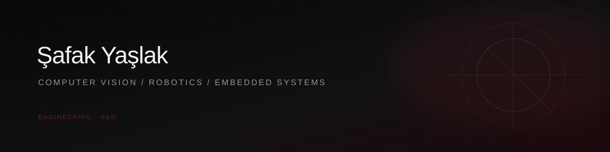

 

Building intelligent systems at the intersection of  
**computer vision, robotics, embedded systems and applied AI.**

  

<a href="https://safakyaslak.github.io/">Portfolio</a>
&nbsp;&nbsp;·&nbsp;&nbsp;
<a href="https://www.linkedin.com/in/safak-yaslak">LinkedIn</a>
&nbsp;&nbsp;·&nbsp;&nbsp;
<a href="mailto:safak.yaslakk@gmail.com">Email</a>

   

&nbsp;&nbsp;&nbsp;

&nbsp;&nbsp;&nbsp;

&nbsp;&nbsp;&nbsp;

&nbsp;&nbsp;&nbsp;

&nbsp;&nbsp;&nbsp;

&nbsp;&nbsp;&nbsp;

&nbsp;&nbsp;&nbsp;

&nbsp;&nbsp;&nbsp;

  

Computer Vision &nbsp;·&nbsp; Robotics &nbsp;·&nbsp; 3D Perception &nbsp;·&nbsp; Embedded Systems

